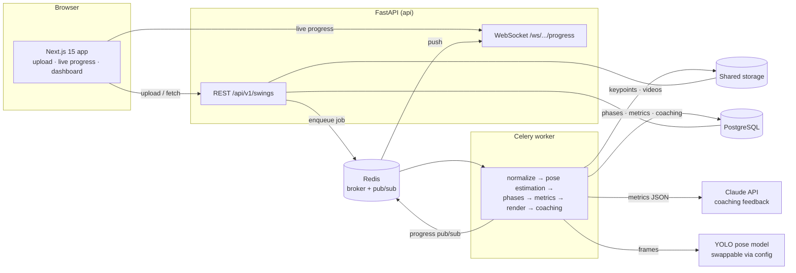

# ⛳ SwingLens

**AI-powered golf swing analysis.** Upload a video of your swing and get back:

1. 🎬 An **annotated video** — full-body skeleton overlay, phase banner, and a phase-colored timeline
2. 🏌️ **Automatic swing phase detection** — the 7 canonical phases, address → finish
3. 📐 **Biomechanical metrics** — tempo, X-Factor, kinematic sequence, early extension, head stability, and more
4. 🤖 **AI coaching feedback** — Claude reads your numbers like a teaching pro and prescribes drills
5. 📈 **Swing history** — every analysis saved so you can track improvement

Built as a polyglot, production-shaped system: a TypeScript frontend and a Python ML
backend communicating over REST + WebSocket, with async video processing behind a
message queue.

## Architecture



**How a swing flows through the system:** the upload endpoint stores the original
video, creates a job row, and returns `202` with an id. A Celery worker normalizes
the video with FFmpeg (H.264, capped resolution, rotation fixed), runs YOLO pose
estimation frame by frame, cleans the keypoint tracks (gap interpolation + centered
moving average), segments the 7 swing phases from the wrist-height signal, computes
the biomechanical metrics, renders the phase-colored annotated video, and asks
Claude for structured coaching feedback. Progress streams to the browser over a
WebSocket fed by Redis pub/sub — with an automatic fallback to polling, since
progress is also persisted on the job row.

## Tech stack

| Layer | Technology |
|---|---|
| Frontend | Next.js 15 (App Router), TypeScript, Tailwind CSS v4, Recharts, Motion |
| ML backend | FastAPI, Ultralytics YOLO pose (`yolo26m-pose`, swappable), OpenCV, NumPy |
| Async pipeline | Celery + Redis (broker & progress pub/sub), WebSockets |
| AI coaching | Claude API (structured output via Pydantic schema) |
| Persistence | PostgreSQL (SQLite for tests/dev), SQLAlchemy 2.0, filesystem artifact store |
| Dev & deploy | Docker Compose, pytest (56 tests) |

## Quickstart

Requires [Docker Desktop](https://www.docker.com/products/docker-desktop/).

```bash
cp .env.example .env          # add ANTHROPIC_API_KEY for AI coaching (optional)
docker compose up --build
```

Then open **http://localhost:3000**, upload a swing video (`.mp4`/`.mov`/`.avi`,
full body visible), and watch it process live. The API docs are served at
http://localhost:8000/docs.

> The first analysis downloads the pose model weights (~50 MB) into a Docker
> volume; later runs start instantly.

## Development without Docker

**Backend** (Python 3.10+; ffmpeg needed for actual video processing):

```bash
cd backend
python3 -m venv .venv && source .venv/bin/activate
pip install -e ".[dev]"
PROCESSING_MODE=inline uvicorn app.main:app --reload   # no Redis/worker needed
pytest                                                  # 56 tests, no ML deps exercised
```

`PROCESSING_MODE=inline` runs the whole pipeline in a background thread of the API
process and the progress WebSocket degrades to database polling — one process, no
infrastructure.

**Frontend** (Node 20+):

```bash
cd frontend
npm install
npm run dev        # expects the API on http://localhost:8000
```

## API at a glance

| Endpoint | Purpose |
|---|---|
| `POST /api/v1/swings/upload` | Upload a video → `202` + job id |
| `GET /api/v1/swings` | List all swings, newest first |
| `GET /api/v1/swings/{id}` | Full analysis: phases, metrics, coaching, video URLs |
| `GET /api/v1/swings/{id}/video/{artifact}` | Stream `original` / `annotated` / `thumbnail` (Range supported) |
| `GET /api/v1/swings/{id}/keypoints` | Raw per-frame COCO-17 keypoints |
| `DELETE /api/v1/swings/{id}` | Delete a swing and its files |
| `WS /ws/swings/{id}/progress` | Live processing progress |

## Design decisions

- **Model-agnostic pose estimation.** Every backend normalizes to a COCO-17
  `KeypointSeries`; the YOLO implementation is one concrete class behind a
  `PoseEstimator` interface, chosen by config with a fallback chain
  (`yolo26m-pose` → `yolo11m-pose`). Swapping models never touches pipeline code.
- **Async processing is mandatory.** Videos take tens of seconds to process; the
  API only ever enqueues. Progress flows through Redis pub/sub *and* the database,
  so the UI works even when the WebSocket can't.
- **Global signal analysis over streaming state machines.** Phase detection
  anchors on the fastest wrist motion in the whole video (biomechanically always
  the downswing), making top/impact detection robust to noise and to
  follow-throughs that finish higher than the top.
- **Honest about 2D.** All angles are projections from monocular video — the
  metrics payload, the UI, and the coaching prompt all carry this caveat. Rotation
  values are proxies, useful for tracking your own progress rather than absolute
  measurement.
- **Coaching is best-effort.** No API key or a failed Claude call never fails the
  analysis; the report is structured output validated against a Pydantic schema,
  so the UI renders typed sections instead of parsing prose.

## Testing

```bash
cd backend && pytest -q
```

The interesting logic — phase segmentation, metric geometry, signal smoothing — is
pure NumPy and unit-tested against a synthetic swing generator with known
ground-truth events. API and WebSocket behavior is covered with integration tests
that stub the ML layer, so the suite runs in under a second with no model weights.

## Roadmap

- [ ] Authentication + per-user swing libraries (NextAuth)
- [ ] Pro comparison: overlay your skeleton against a reference swing
- [ ] Side-by-side comparison of two of your own swings
- [ ] Export & public share links
- [ ] PWA → React Native with on-device inference (LiteRT/CoreML export)

## Provenance

SwingLens grew out of a CSE 455 computer vision class project (a MediaPipe CLI
script, preserved in [`legacy/`](legacy/)). The platform is a ground-up rebuild:
new pose stack, new phase detection, new metrics engine, and a full product around
them.
